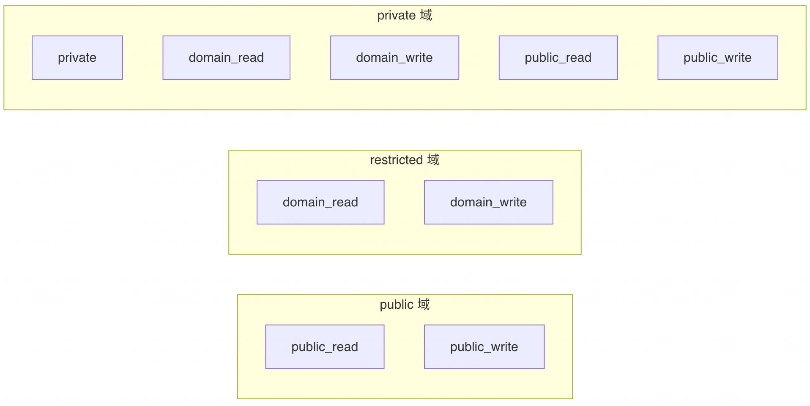

# 域隔离（Domain）

## 设计意图

mdocs 中的「域」是最顶层的逻辑隔离单元。它的设计目标是：

- 不同团队或项目之间的文档彼此不可见
- 在不引入复杂 RBAC 的前提下实现最基本的访问边界
- 让每个用户拥有一个「个人域」作为私密工作区

本质上，域只是个存在于逻辑上的虚拟概念，需要和实际的目录绑定才可被用户观测

## 三种域类型

| 域类型                   | 谁可以进入 | 文件允许的权限档位                  | 用途                 |
| ------------------------ | ---------- | ----------------------------------- | -------------------- |
| **public**（公开域）     | 任何人     | `public_read(3)`、`public_write(4)` | 开放协作，所有人可见 |
| **restricted**（受限域） | 仅域成员   | `domain_read(1)`、`domain_write(2)` | 团队内部知识库       |
| **private**（个人域）    | 仅域主一人 | 0～4 全部档位均可                   | 私人笔记本           |

> **关键约束**：域类型决定了域内文档可用的权限范围。public 域里不会出现 `private` 或 `domain_read` 的文档，反之亦然。

**域权限和文档权限关系图**

## 五级文档权限

每篇文档有一个 `permission` 字段（0～4），定义谁能读、谁能写：

| 数值 | 名称         | 谁可读   | 谁可写   |
| ---- | ------------ | -------- | -------- |
| 0    | private      | 仅 owner | 仅 owner |
| 1    | domain_read  | 域成员   | 仅 owner |
| 2    | domain_write | 域成员   | 域成员   |
| 3    | public_read  | 任何人   | 仅 owner |
| 4    | public_write | 任何人   | 任何人   |

## 个人域（Private）

- 每个访客注册时自动创建一个个人域，`domain_id` 等于该访客的 `visitor_id`
- 个人域**只有域主一个成员**（不引入 `domain_members` 多行）
- 文件权限可设为 0～4 任意档位——即使名为「个人」域，也可以公开某篇文档
- 创建文档时默认权限为 `private(0)`

## 域绑定规则

域一旦创建并绑定目录后：

- **不可删除**（否则需要级联清理所有文档和历史）
- **不可修改域类型**（否则域内文档的权限档位可能违反域约束）

不支持域的变更。

> 如果创建了域，但没有给域绑定目录，那么域是不可见的

## 设计取舍

- **不引入团队/组织树**：域只是逻辑标签。对于小团队，一个 public 域 + 每人一个 private 域就足够
- **create_visitor_id 即身份**：所有域、文件、目录，都是通过create_visitor_id表示权限归属者
- **域隔离在 SQL 层面，不在文件系统**：所有文件存储在~/.mdocs/files，`domain` 只存在于数据库，移动文档只需改数据库记录，不能修改实际文件目录位置。否则可能导致映射关系错位
