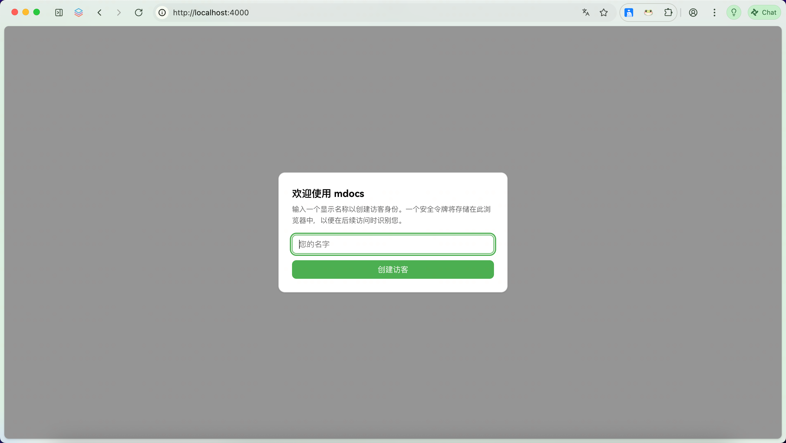
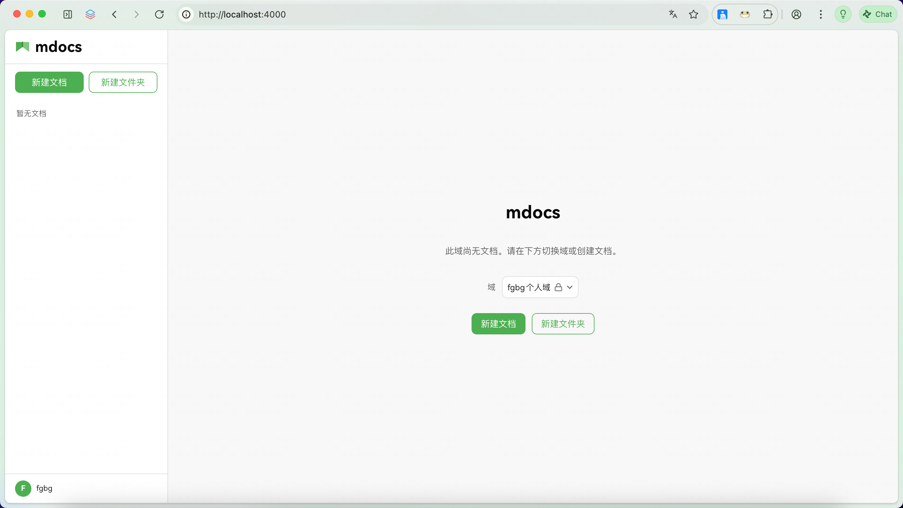

# 第一个文档

## 创建身份

启动 mdocs 后，浏览器会弹出**访客注册**对话框——输入一个名称即可创建身份

## 创建文档

1. 注册完成后，点击左侧边栏的「新建文档」
2. 输入文件名（如 `hello.md`），点击创建
3. 文档创建后自动进入编辑器

## 编辑器界面

点击`新建文档`，创建md文档。点击`创建文件夹`，创建文件夹

## 编辑与保存

- **自动保存**：编辑内容实时存入浏览器本地数据库（IndexedDB），断网不丢
- **发布**：点击「发布」将内容同步到服务器，持久化为 Markdown 文件

## 目录结构

文档在文件系统中以文件形式存储。后端将文档路径树映射为左侧边栏的文件夹结构，支持嵌套目录。

## 核心思路

mdocs 的设计哲学是：**编辑时用富文本，存储时用Lexical维护的Json**。编辑器内部使用 Lexical JSON 保留格式信息，发布时写入 `.md` 文件，确保数据永远可读、可迁移。
