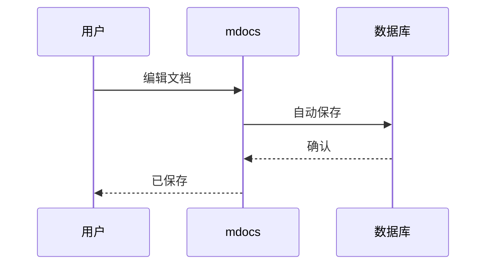

# 流程图生成

## Mermaid 支持

mdocs 内置 Mermaid 渲染引擎，支持以下图表类型：

- 流程图（Flowchart）
- 时序图（Sequence Diagram）
- 类图（Class Diagram）
- 状态图（State Diagram）
- 甘特图（Gantt Chart）

## 使用方式

在 Markdown 中使用 `mermaid` 代码块：

## 拖拽生成

通过工具栏拖拽节点，自动生成 Mermaid 文本，无需手写代码。
