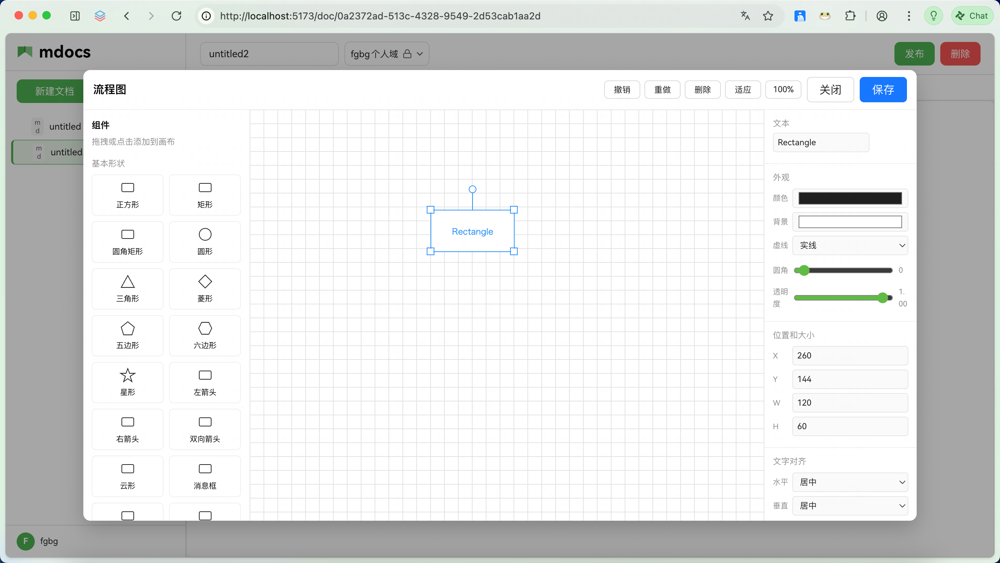

# 流程图生成

## 设计思路

mdocs 的流程图基于 **Meta2d** 绘图引擎，设计目标是让用户像使用 Visio 或 draw.io 一样拖拽绘制，同时将图表数据嵌入文档内容。

## 插入方式

### 斜杠菜单（推荐）

不必手写 Markdown / 围栏语法。在编辑器中：

1. 新起一行（或光标在段落里）输入 `/`
2. 选择 **Meta2d**，或继续输入 `meta2d` 过滤后回车
3. 插入后会打开 Meta2d 画布，拖拽绘制即可


完整菜单项说明见 [编辑体验 · 斜杠菜单](./markdown.md#斜杠菜单推荐快捷入口)。

### 其他方式（可选）

仍支持在新行输入围栏后回车打开画布（适合熟悉旧习惯的用户）：

```
---meta2d---
```

日常插入请优先用 `/`。

## 数据格式

图表在文档中以内嵌块保存（存储形态，**插入时不必手写**）：

```
---meta2d---
{ "pens": [ … ] }
---/meta2d---
```

编辑器渲染时：
- 识别到该块 → 调用 canvas2svg 渲染为 SVG 预览
- 双击块 → 打开 Meta2d 画布编辑器，可拖拽编辑
- 保存 → 将 JSON 写回文档内容

## 编辑器界面



## 支持的图形

矩形、圆角矩形、圆形、菱形、三角形、五边形、文本、线条、数据节点、数据库、文档、显示、手动输入、并行、注释、子流程、队列、内部/外部存储等。

## 设计取舍

- **为什么用 Meta2d 而非 Mermaid**：Mermaid 适合由文本生成图表，但交互式编辑体验不够直观。Meta2d 提供了拖拽式 GUI 编辑器，更接近白板体验
- **数据内嵌在文档内容中**：图表以 JSON 格式内嵌在文档内容里，随文档一起存储，复制、备份都很方便

## Markmap 思维导图

### 使用方式

#### 斜杠菜单（推荐）

输入 `/` → 选 **Markmap**（或过滤 `markmap`）插入，无需先背代码块语法。

#### 代码块（可选）

也可手写 `markmap` 围栏，用 Markdown 标题层级描述树：

````markdown
```markmap
# 根节点
## 分支 1
### 子节点 1.1
### 子节点 1.2
## 分支 2
```
````

### 特性

- **Markdown 语法**：使用标准 Markdown 标题层级（`#`）定义树形结构
- **实时渲染**：编辑 Markdown 时下方实时预览思维导图
- **交互一致**：与 Mermaid 代码块交互方式完全相同
  - 点击内部显示源码编辑器
  - 点击外部隐藏源码，只显示思维导图
  - 点击图表进入全屏预览模式
- **全屏预览**：支持缩放、拖拽，查看复杂导图更方便
- **错误提示**：Markdown 语法有误时显示红色错误框

### 与 Mermaid 的区别

| 特性 | Markmap | Mermaid |
|------|----------|---------|
| 语法 | Markdown 标题层级 | Mermaid 专有语法 |
| 用途 | 思维导图、知识树 | 流程图、时序图、类图等 |
| 交互 | 点击折叠/展开节点 | 静态渲染 |
| 适合场景 | 头脑风暴、知识梳理 | 技术架构、业务流程 |
