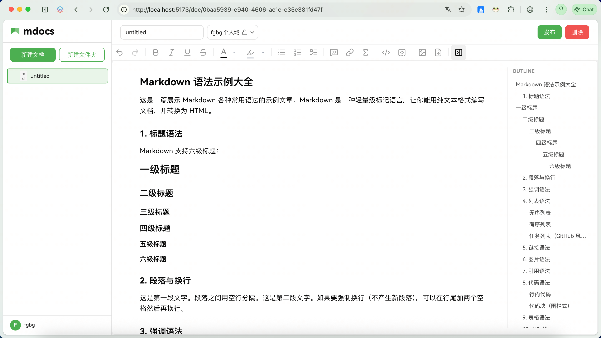

# 编辑体验

## 设计思路

mdocs 的编辑器基于 Lexical（Meta 开源的富文本引擎），配合 `@lobehub/editor` 插件体系。核心思路是：**用富文本编辑，以 JSON 存储**。

```
编辑时
  用户操作 → Lexical JSON（保留全部格式信息）
  自动保存 → IndexedDB（Lexical JSON）

发布时
  内容写入 → 文件系统（Lexical JSON 文件）
```

这意味着：

- 编辑时享受完整的富文本体验（标题、加粗、表格、代码块等）
- 文档以 Lexical JSON 格式持久化，保留全部语义信息，重新打开时精确恢复
- 由于是自有格式，文档**只能由 mdocs 加载**（未来会提供导出 Markdown 功能）

## Markdown 导入

mdocs 支持直接粘贴或通过 API 传入 Markdown 文本，后端会自动转换为 Lexical JSON 存储。

### 粘贴 Markdown

在编辑器中直接粘贴（`Ctrl+V`）Markdown 文本，内容会按富文本格式渲染，保留标题、粗体、列表、表格、代码块等结构。

### API / CLI 传入 Markdown

通过 API 或命令行客户端创建/更新文档时，传入的 Markdown 内容会自动转换：

```bash
# CLI 创建文档，直接传 Markdown
node ~/.mdocs-cli/mdocs.mjs create \
  --name "笔记.md" \
  --content "# 标题\n\n这是**粗体**和*斜体*"
```

转换能力包括：
- 标题 h1-h6、段落、换行
- 粗体/斜体/删除线/行内代码/超链接
- 有序/无序列表（支持嵌套）
- 代码块（保留语言标识）
- 引用块、分隔线
- 表格（含表头、合并单元格）

## 编辑器功能

编辑时有两条常用入口：**顶部工具栏**（点选）和 **斜杠菜单**（键盘快速插入）。多数插入项两边都能找到。

### 斜杠菜单（推荐快捷入口）

在编辑器**空行或段落中**输入 `/`，弹出可搜索的插入菜单；继续打关键字（如 `table`、`meta2d`）可过滤，回车或点击插入。


常见项（右侧为过滤关键字，以当前版本界面为准）：

| 菜单项 | 关键字示例 | 作用 |
|--------|------------|------|
| Heading 3 | `h3` | 三级标题 |
| Hr | `hr` | 水平分割线 |
| Table | `table` | 表格 |
| TeX | `tex` | 数学公式 |
| File | `file` | 上传并插入附件 |
| Insert Link | `insert-link` | 超链接 |
| Inline Code | `insert-codeInline` | 行内代码 |
| Code Block | `insert-codeBlock` | 代码块（语法高亮） |
| Meta2d | `meta2d` | 流程图画布，详见 [流程图生成](./flowchart.md) |
| Markmap | `markmap` | 思维导图，详见 [流程图生成 · Markmap](./flowchart.md#markmap-思维导图) |

插入 Meta2d 后一般会自动打开画布。日常请用 `/` 插入；围栏写法仅作可选兼容，见 [流程图生成](./flowchart.md)。

### 富文本工具栏

编辑器顶部工具栏覆盖格式与插入（与斜杠菜单互补）：

- **撤销 / 重做**
- **文档首尾插行**：在全文最上方或最后一行之后插入空段落
- **标题**：H1 ~ H3
- **文本格式**：加粗、斜体、下划线、删除线、字色 / 高亮
- **列表与引用**：无序 / 有序 / 待办、引用
- **插入**：链接、图片、表格、代码、TeX、附件等
- **大纲**：可一键展开 / 折叠右侧大纲面板

适合鼠标点选改格式；批量插入块级内容时优先用 `/`。

### 大纲面板

编辑器右侧自动提取文档标题层级，生成可点击的导航大纲，方便在长文档中快速跳转。



### 文档信息菜单

编辑器工具栏右侧提供文档信息入口（三条线图标），点击可查看：

**元信息区**
- **创建者**：显示访客昵称，未设置昵称时显示 visitorId 前 8 位
- **创建时间**：文档创建的本地化日期格式
- **大小**：文件体积（KB/MB 自动适配）
- **上次编辑**：最后修改的本地化时间

**操作区**
- **收藏/取消收藏**：一键切换当前文档的收藏状态
- **修改文章权限**：后续版本开放完整的权限修改对话框

> 💡 点击菜单外部区域可自动关闭下拉菜单。收藏按钮 hover 时有缩放动画效果。

### 流程图

支持 **Meta2d** 流程图。优先在编辑器输入 `/`，选 **Meta2d** 插入并打开画布；不必手写围栏语法。

详见 [流程图生成](./flowchart.md)。

## 设计取舍

- **选择 Lexical 而非 Prosemirror/Slate**：Lexical 对 React 生态更友好，插件系统清晰，且 `@lobehub/editor` 提供了开箱即用的工具栏和斜杠菜单。只需在lobehub项目基础上进行额外开发，避免重复造轮子
- **JSON 存储**：保留完整的富文本结构，重新打开时精确还原编辑状态。代价是数据不能直接用文本编辑器阅读——未来会提供 Markdown 导出
