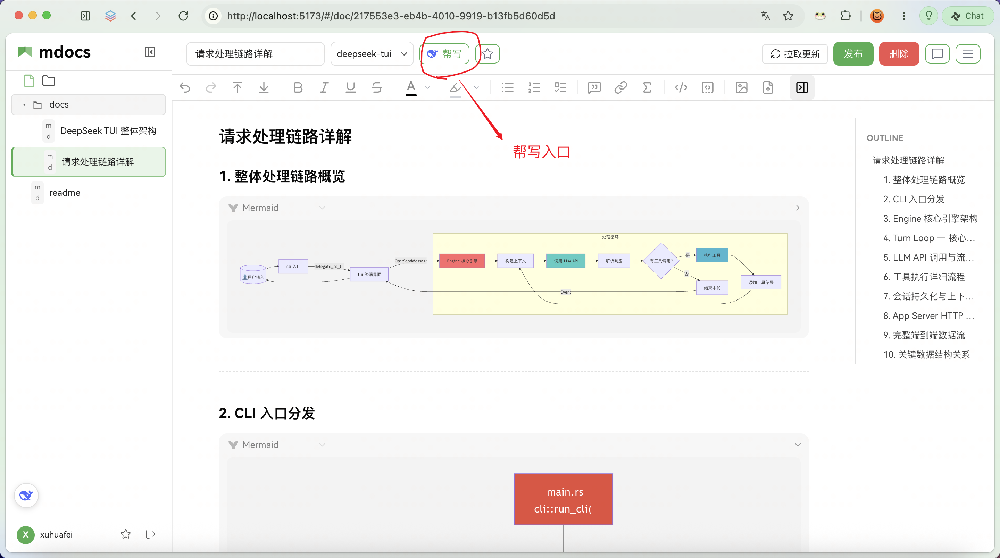
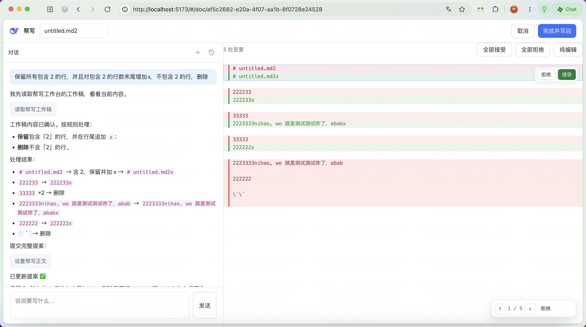

# 智能助手（AI）

mdocs 内置 **两种 AI 能力模式**，共用设置页里的 DeepSeek 配置。

**最大区别是用户交互度：**

| | 🤖 智能助手 | ✍️ 帮写（Coding） |
|--|-------------|-------------------|
| **交互度** | **低**：以结果为导向，正文侧偏 **一次覆写**（空文可直写；有正文需你点确认或改走帮写） | **高**：以过程为导向，必须和你 **交互审阅**——分段提案、接受/拒绝，你拍板后才写回 |
| **你在干什么** | 提需求 →（必要时确认）→ 看结果 | 提需求 → 看 Diff → 逐段/整批决定 → 完成并写回 |

其他差异是为此服务的：

| 对比维度 | 智能助手（Ask / Normal） | 帮写（Coding） |
|---------|--------------------------|----------------|
| **入口** | 左下角悬浮球（可拖动） | 编辑器顶栏「帮写」/ 欢迎页「AI 帮写」 |
| **UI** | 小浮层 | 全屏工作台（左对话、右 Markdown Diff） |
| **写回时机** | 确认后直接写服务端（覆写） | 在缓冲区改到满意，点「完成并写回」才进本地草稿 |
| **能力侧重** | 答疑、搜文、建空文档/文件夹、找位置、全文一键生成/重写 | 起草、改稿、润色、续写，精细控制每一段 |
| **会话** | 全局历史（不绑文档） | 按文档隔离 |
| **存储** | `tenant/<id>/agent/session/` | `tenant/<id>/agent/coding-session/` |

**一句话：** 要快、愿意一次覆写 → 智能助手；要和 AI 来回改、段段把关 → 帮写。

若你要用 Cursor / Claude 等**外部 Agent** 读写知识库、落开发契约，见 [Agent 开发闭环](./agent-dev-loop.md)。

---

## 智能助手（Ask / Normal）

左下角圆形 **智能助手** 入口（可拖动）。点击打开浮层 **「mdocs 智能助手」**，主编辑区仍保持打开。按住拖动可改位置（本地记住）；挪过之后会出现「重置位置」。

浮层开场会说明分工：**答疑用智能助手**（可搜文、建空文档、帮你找位置）；**写 / 精细改正文请用顶栏「帮写」**。

浮层内：
- 顶部：**+** 新建会话、历史列表、关闭
- 中间：问候语、快捷提问（如「如何发布文档？」「草稿是什么？」「如何创建域？」）与对话内容
- 底部输入框：占位「把你的问题告诉我…」
- 页脚提示：内容由 AI 生成，仅供参考

### 可以做什么

直接问，例如：
- 如何发布文档？草稿是什么？
- 如何创建域？权限怎么设置？
- 帮我搜索 / 列出某域文档，并打开其中一篇说明要点
- 帮我创建一个空文档「XXX」
- 这篇文档几乎是空的，帮我写个大纲并直接写好

### 覆写机制（有正文时）

当文档已有实质内容，智能助手不会静默改写。你若要求覆写，助手会弹出**选择卡**，三选一：
1. **直接覆写** → 同意后线性写入服务端（带版本冲突校验）
2. **打开帮写审阅** → 跳帮写模式，先在右侧看提案再决定
3. **取消** → 不写

### 明确不会做

- 静默改写有实质正文的文档（必须经你确认或走帮写）
- 越权读取你无权查看的文档（与网页端同一套权限）
- 精细改稿 / 逐段审阅（请用顶栏 **帮写**）

---

## 帮写（Coding 模式）

需要和 AI **高交互**地改正文（逐段看 Diff、接受/拒绝）时用 **帮写**。智能助手偏覆写结果；帮写偏过程协作。

### 入口

打开一篇文档后，在编辑器**顶栏工具条右侧**（发布 / 删除附近）点击 **帮写**（带星标图标）进入全屏工作台。欢迎页也可点「AI 帮写」从空白开始。

### 工作流

1. 通过顶栏 **帮写**（或欢迎页「AI 帮写」）进入全屏层：左侧对话，右侧 Markdown
2. 描述要写/改的内容；助手会先读当前工作稿与进场快照，再提交完整 Markdown 提案
3. 右侧按变更段 **接受 / 拒绝**；也可继续手改
4. **完成并写回**：已有文档写入本地草稿（需你再发布）；空白帮写则创建新文档

### 工作台界面

| 区域 | 说明 |
|------|------|
| **顶栏** | 文档名；**取消**退出；**完成并写回**把已接受内容写回（已有文进本地草稿） |
| **左侧 · 对话** | 说明要写/改什么；助手可「读取帮写工作稿」再「设置帮写正文」更新提案；**+** / 历史管理会话 |
| **右侧 · 提案** | 红删绿增的分段 Diff；可 **全部接受 / 全部拒绝**，或逐段操作；也可切 **纯编辑** 手改；底部可在变更间跳转 |

### 核心设计：高交互审阅

帮写的核心不是「更能写」，而是 **必须和你交互**：
- AI 吐出的是**完整 Markdown 提案**，不是直接改文件
- 前端 diff 计算后**按段高亮**，每段你可独立「接受」或「拒绝」
- 接受的段落合并进「当前稿」，剩余可继续手改或再次 AI 续写
- 全程**不碰服务端**，直到你点「完成并写回」才写入本地草稿

### 会话说明

- 帮写会话与智能助手**完全隔离**，互不干扰
- **按文档隔离**：文章 A 的历史看不到文章 B
- 左侧同样有 **+** / 历史；历史只回放对话文字，不恢复右侧稿
- 从空白帮写写回成文后，当前对话会绑到新文档，下次打开该文帮写可续聊

---

## 开始使用前：配置模型

1. 打开 **设置 → AI**（侧栏底部访客信息进入设置）
2. 选择模型：`deepseek-v4-flash` 或 `deepseek-v4-pro`
3. 填写你的 DeepSeek API Key 并保存

未配置 Key 时，入口可用但无法发送消息，浮层 / 帮写会提示去设置页配置。

每人一份配置，仅本人可用；Key 在服务端按访客隔离存储，不会出现在别的访客界面上。配置页可查看配置名称、模型、脱敏后的 Key 与配置 ID；需要改时可点 **编辑**。

## 怎么问（智能助手）

可以直接问，例如：

- 如何发布文档？
- 草稿是什么？
- 如何创建域？
- 权限怎么设置？
- 帮我搜索 / 列出某域文档，并打开其中一篇说明要点

助手会按需阅读 [mdocs 用户手册](https://xuhuafeifei.github.io/mdocs-site/) 相关章节，也可在你有权阅读的范围内读取知识库文档。工具结果（搜索表、域树、读文预览等）会出现在对话时间线中，**默认折叠**，展开可查看；历史会话重开后通常只保留文字、不再回放这些工具块。答完后通常会附带一两个可继续追问的示例。

## 会话（智能助手）

- 同一访客的对话会保存在数据目录 `tenant/<访客ID>/agent/session/` 下，刷新或重开浮层仍可续聊。
- 浮层标题栏 **「+」**：新建空会话并切换过去。
- **历史图标**：按最近更新列出会话；点击即可切换并回放该会话（纯文本；工具 UI 不落盘）。
- 会话标题取自**第一条用户消息**（过长会截断），不是模型摘要。
- 删除、重命名、按天数自动清理尚未提供。

## 明确不会做（智能助手）

- 静默改写有实质正文的文档（必须经你弹出选择卡确认）
- 越权读取你无权查看的文档（与网页端同一套权限）
- 静默替你发布或改权限档（结构操作会走工具；写作类请求会根据上下文决定直写或弹选择卡）

若你在智能助手里要求写作，助手会根据文档状态决定：空文直接覆写，有正文则弹出选择卡。
