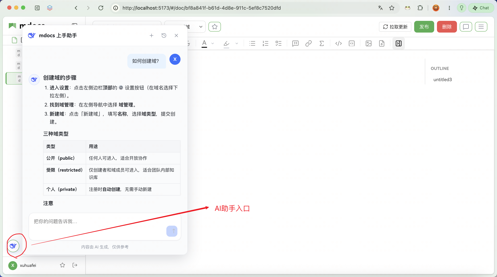
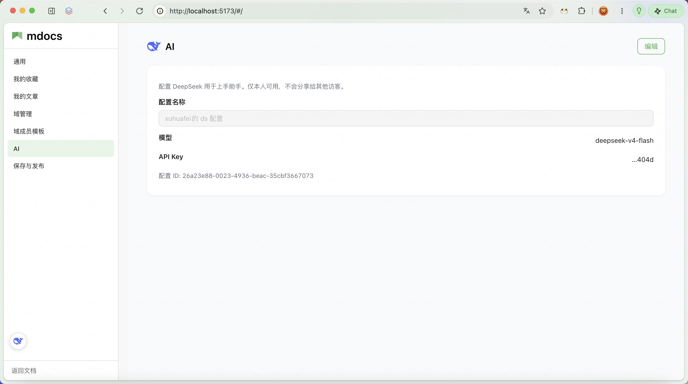

# 上手助手（AI）

mdocs 内置了一个**产品上手向导**，只解答「怎么用 mdocs」（域、草稿、发布、权限等），**不会**帮你写正文或改文档。

若你要用 Cursor / Claude 等**外部 Agent** 读写知识库、落开发契约，见 [Agent 开发闭环](./agent-dev-loop.md)。

## 入口

左下角有圆形 **上手助手** 悬浮按钮（不占用正文区）。点击后打开浮层 **「mdocs 智能助手」**，主编辑区仍保持打开，可边问边写。可**按住拖动**入口到任意位置（本地记住）；挪过之后会出现「重置位置」。

浮层内：

- 顶部：**+** 新建会话、历史列表、关闭
- 中间：对话与指引内容（可含步骤、表格等）
- 底部输入框：占位「把你的问题告诉我…」
- 页脚提示：内容由 AI 生成，仅供参考

## 开始使用前：配置模型

1. 打开 **设置 → AI**（侧栏底部访客信息进入设置）
2. 选择模型：`deepseek-v4-flash` 或 `deepseek-v4-pro`
3. 填写你的 DeepSeek API Key 并保存

未配置 Key 时，入口可用但无法发送消息，浮层会提示去设置页配置。

每人一份配置，仅本人可用；Key 在服务端按访客隔离存储，不会出现在别的访客界面上。配置页可查看配置名称、模型、脱敏后的 Key 与配置 ID；需要改时可点 **编辑**。

## 怎么问

可以直接问，例如：

- 如何发布文档？
- 草稿是什么？
- 如何创建域？
- 权限怎么设置？

助手会按需阅读 [mdocs 用户手册](https://xuhuafeifei.github.io/mdocs-site/) 相关章节再回答，并在回复里展示「已阅读 N 个页面」与手册链接。答完后通常会附带一两个可继续追问的示例。

## 会话

- 同一访客的对话会保存在数据目录 `tenant/<访客ID>/agent/session/` 下，刷新或重开浮层仍可续聊。
- 浮层标题栏 **「+」**：新建空会话并切换过去。
- **历史图标**：按最近更新列出会话；点击即可切换并回放该会话。
- 会话标题取自**第一条用户消息**（过长会截断），不是模型摘要。
- 删除、重命名、按天数自动清理尚未提供。

## 明确不会做

- 代写、润色、按选区改文档
- 替你点击发布或改权限（只会告诉你怎么操作）

若你要求写作，助手会拒绝并引导你在编辑器里自行操作。
