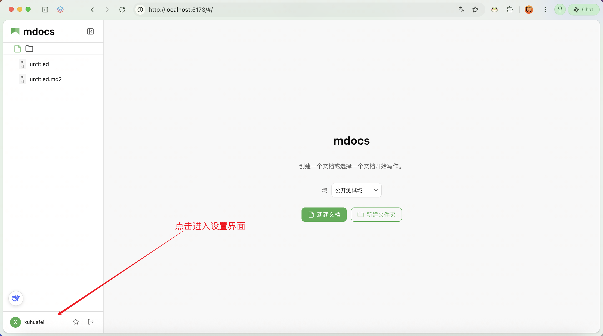
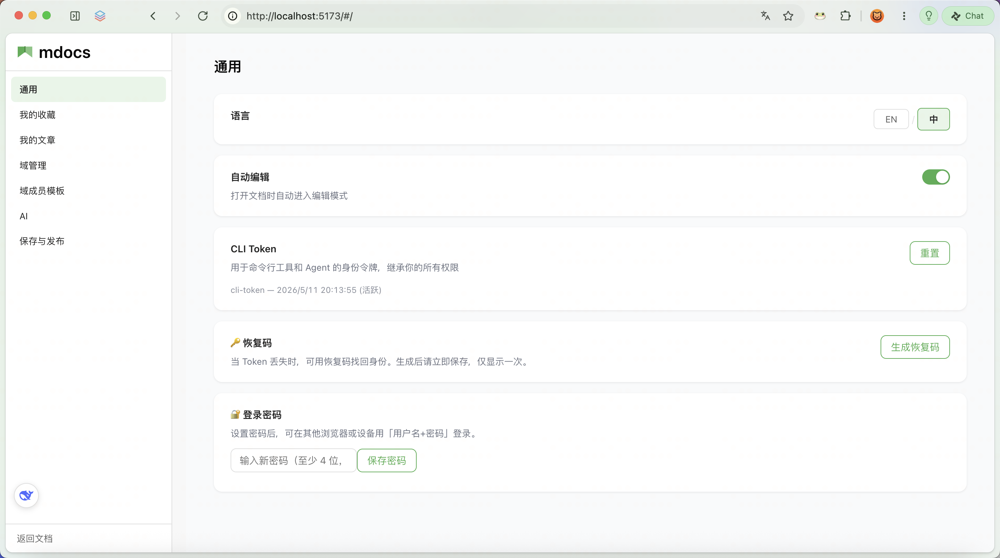

# 设置页面

## 功能概述

设置页面是 mdocs 的集中配置中心：身份与密码、收藏与文章、域与成员模板、智能助手、草稿同步等都在这里。

## 入口

点击左侧边栏**底部的访客信息区**（头像 + 昵称那一行），进入设置页面。

侧栏底部另有 **返回文档**，可随时回到编辑主界面。

---

## 左侧导航概览

顺序与界面一致：

| 导航项 | 功能 |
|-------|------|
| [通用](#通用设置) | 语言、自动编辑、CLI Token、恢复码（兼容）、登录密码 |
| [我的收藏](./bookmarks.md) | 收藏列表、搜索、取消收藏 |
| [我的文章](./my-documents.md) | 自己创建的文档、邀请成员、打开 |
| [域管理](./domain-members.md) | 创建 / 筛选 / 重命名 / 改类型 / 删除域；受限域成员 |
| [域成员模板](./domain-members.md) | 可复用的访客名单 |
| [AI](./onboarding-ai.md) | 智能助手与帮写的 DeepSeek 配置 |
| [保存与发布](./drafts.md) | 本地快照、自动同步、未发布草稿 |

---

## 通用设置

### 语言

「中」/「EN」即时切换界面语言，无需刷新。

### 自动编辑

开启后，打开文档时自动进入编辑模式；关闭则默认只读，需手动点编辑。

- **写作为主**：建议开启
- **阅读为主**：建议关闭

### CLI Token

给命令行与外部 Agent 用的身份令牌，继承你的权限。可查看活跃 Token、重置。详情见 [CLI Token](./cli-token.md)。

### 恢复码（兼容）

Token / Cookie 丢失时的自助找回；引入登录密码后已边缘化。详情见 [恢复码与身份找回](./recovery-code.md)。

### 登录密码（推荐跨端）

设置至少 4 位密码后，可在其他浏览器或设备用「用户名 + 密码」登录同一访客。

---

## 其他模块一览

各页详情见对应文档；此处仅对照设置内截图入口。

| 模块 | 文档 |
|------|------|
| 我的收藏 | [收藏功能](./bookmarks.md) |
| 我的文章 | [我的文章](./my-documents.md) |
| 域管理 / 域成员模板 | [受限域成员与名单模板](./domain-members.md) |
| AI | [智能助手（AI）](./onboarding-ai.md)（含 DeepSeek 配置与私人 Agent Skills） |
| 保存与发布 | [草稿与同步](./drafts.md) |

---

## AI 设置里的 Agent Skills

在 **设置 → AI**，DeepSeek 配置下方有 **Agent Skills**：

- 新建 / 编辑 / 删除**私人**提示词宏（仅本人可见）
- **名称**对本账号唯一，仅允许英文、数字、下划线（如 `weekly_report`）
- 在智能助手或帮写输入区点 **Skill**，按名称勾选后随本轮消息引用

也可在对话里让助手调用管理工具（列出、新建、修改、删除）；新建与修改会弹出带倒计时的表单卡。

详情见 [智能助手（AI）](./onboarding-ai.md#私人-agent-skills)。

---

## 常见问题

### 设置会保存在哪里？

语言、自动编辑、自动同步等偏好多在浏览器本地；与身份绑定的数据（收藏、域与成员、模板、CLI Token、密码哈希、恢复码哈希、AI 配置）在服务端。

### 为什么看不到某些操作？

- **域管理**：重命名 / 删除等通常仅域创建者可见
- **受限域「成员」**：仅受限域且你是创建者时才有
- **邀请成员**：仅自己创建的文档显示
